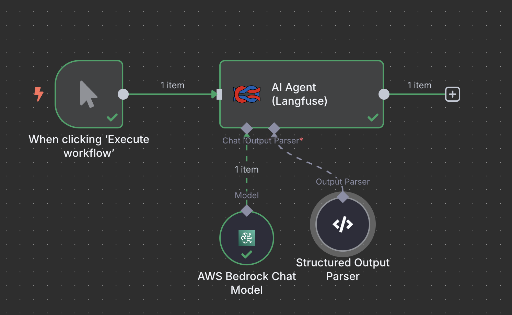
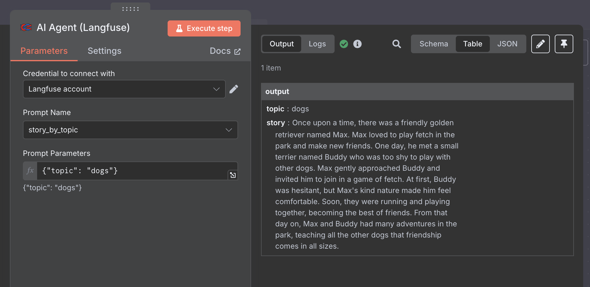

# n8n-nodes-langfuse-ai-agent

This is an n8n community node that integrates with [Langfuse](https://langfuse.com/) to run AI agents with prompt management and tracing capabilities. It allows you to execute AI workflows using prompts stored in Langfuse, with automatic tracing and monitoring of your AI operations.

Langfuse is an open-source LLM observability and prompt management platform that helps you monitor, debug, and improve your AI applications.

[n8n](https://n8n.io/) is a [fair-code licensed](https://docs.n8n.io/reference/license/) workflow automation platform.

[Installation](#installation)  
[Operations](#operations)  
[Credentials](#credentials)  
[Compatibility](#compatibility)  
[Usage](#usage)  
[Resources](#resources)  

## Installation

Follow the [installation guide](https://docs.n8n.io/integrations/community-nodes/installation/) in the n8n community nodes documentation.

## Operations

### AI Agent (Langfuse)

Executes an AI agent using prompts from Langfuse with structured output parsing and automatic tracing.

**Inputs:**
- **Main**: Any data you want to pass to the AI agent
- **Chat Model**: An AI language model connection (required)
- **Output Parser**: A structured output parser connection (required)

**Outputs:**
- **Main**: The structured output from the AI agent

## Credentials

### Langfuse API

To use this node, you need to set up Langfuse credentials:

1. **Sign up for Langfuse**: Create an account at [Langfuse Cloud](https://cloud.langfuse.com/) or set up a self-hosted instance
2. **Get your API keys**: 
   - Go to your Langfuse project settings
   - Navigate to the API Keys section
   - Create a new API key or use an existing one
3. **Configure credentials in n8n**:
   - **Langfuse Host URL**: Your Langfuse instance URL (default: `https://cloud.langfuse.com`)
   - **Public Key**: Your Langfuse public API key
   - **Secret Key**: Your Langfuse secret API key

## Usage

### Setting up your workflow

1. **Add the Langfuse AI Agent node** to your workflow
2. **Connect a Chat Model**: Add an AI language model node (like OpenAI, Anthropic, etc.) and connect it to the "Chat Model" input
3. **Connect an Output Parser**: Add a structured output parser node and connect it to the "Output Parser" input
4. **Configure the node**:
   - **Prompt Name**: Select a prompt from your Langfuse project (the node will automatically fetch available prompts)
   - **Prompt Parameters**: Provide parameters for your prompt as a JSON object

### Example workflow

Here's a simple example of how to use the Langfuse AI Agent node:

1. **Start with a trigger** (e.g., Manual trigger)
2. **Add an AI model** (e.g., OpenAI)
3. **Add an output parser** (e.g., Structured Output Parser)
4. **Add the Langfuse AI Agent node** and connect both the AI model and output parser
5. **Configure the node** with your prompt name and parameters

### Node Configuration



The node configuration panel shows:
- **Prompt Name**: Dropdown of available prompts from your Langfuse project
- **Prompt Parameters**: JSON object containing parameters for your prompt

### Node Panel



The node panel displays:
- Input connections for Chat Model and Output Parser
- Output connection for the structured result
- Credentials configuration for Langfuse API

### Example Prompt Parameters

```json
{
  "user_input": "{{ $json.user_message }}",
  "context": "{{ $json.context }}",
}
```

### Tracing and Monitoring

The node automatically:
- Traces all AI operations in Langfuse
- Logs prompts, responses, and metadata
- Provides observability into your AI workflows
- Enables debugging and performance monitoring

## Resources

* [n8n community nodes documentation](https://docs.n8n.io/integrations/#community-nodes)
* [Langfuse Documentation](https://langfuse.com/docs)
* [Langfuse API Documentation](https://langfuse.com/docs/api)
* [n8n AI Nodes Documentation](https://docs.n8n.io/integrations/builtin/cluster-nodes/sub-nodes/n8n-nodes-langchain/)

## License

[MIT](https://github.com/n8n-io/n8n-nodes-starter/blob/master/LICENSE.md)
